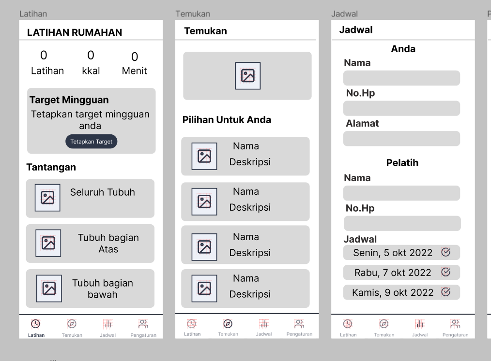
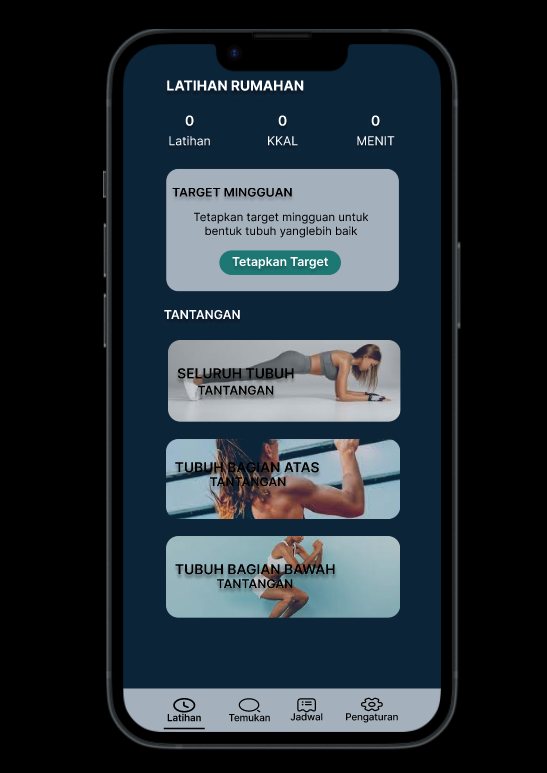

# Design

Aplikasi Latihan Rumahan akan dibangun menggunakan front-end client, backend server, dan database. Client front-end akan diimplementasikan menggunakan HTML, CSS, dan JavaScript, dan akan berkomunikasi dengan server backend menggunakan RESTful API. Server backend akan menggunakan database MySQL untuk menyimpan tugas dan data aplikasi lainnya.

# User interface design:

User Interface untuk aplikasi latihan rumahan akan sederhana, dengan fokus pada kemudahan penggunaan. Layar utama akan menampilkan daftar latihan berdasarkan berbagai kriteria. Setiap tugas akan memiliki judul, deskripsi, dan akan ditampilkan dalam tata letak seperti kartu. Pengguna akan dapat membuat, mengedit, dan menghapus kategori atau daftar untuk mengatur latihan mereka.

## Wireframe

Screenshots of wireframes

Ini merupakan contoh wireframe dari aplikasi latihan rumahan. Ini gambaran awal untuk membuat aplikasi latihan rumahan nantinya. dimana ada tampilam latihan, temukan, jadwal serta pengaturan. 

## Mockups

Screenshots of mockups

Ini gambaran yang akan digunakan untuk membuat aplikasi latihan rumahan, dimana sudah terdapat warna tampilan serta alur yang lebih jelasnya agar programmer lebih mudah untuk melakukan pengkodingan.

# Demo
[Latihan Rumahan]
- (https://www.figma.com/file/R4EdIliQQYRS7jPsmrnBc2/UTS_Anisa?node-id=0%3A1&t=tgvhG3if9koMlTVG-1)
- (https://www.figma.com/file/tD0uDK9JWBHsNHsGgInfJn/Anisa_UI%2FUX?node-id=18%3A293&t=IxySRiit0v5zxTUN-1)