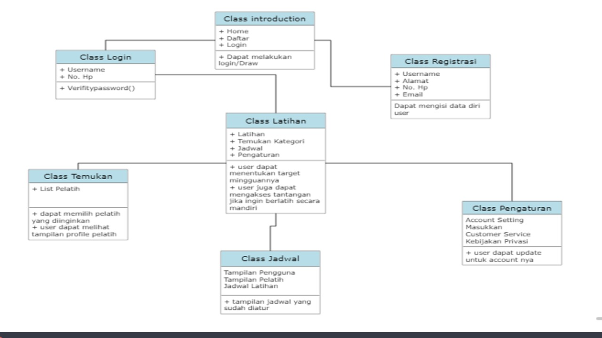
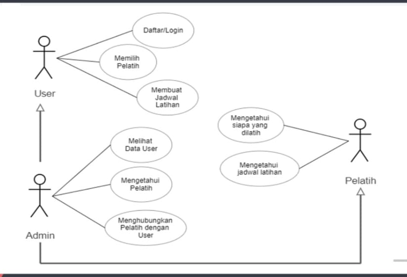
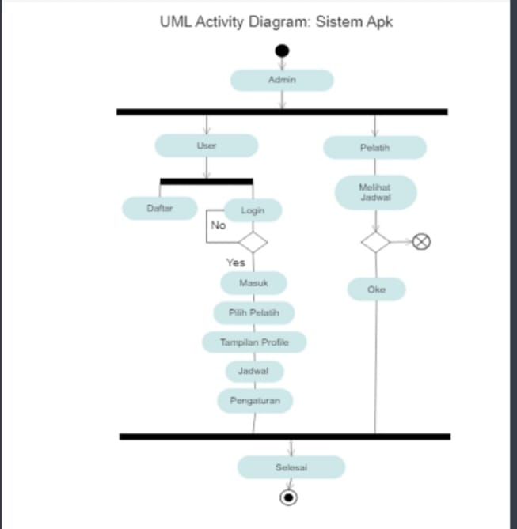

# Requirements

- Client front-end aplikasi harus dibangun menggunakan HTML, CSS, dan JavaScript, dan harus dirancang agar responsif dan bekerja dengan baik di perangkat seluler.
- User Interface harus mengizinkan pengguna untuk mengedit latihan yang ada dengan mengubah nama latihan, atau tanggal latihan.
- User Interface harus memungkinkan pengguna menandai latihan sebagai selesai atau tidak selesai.
- Aplikasi harus memiliki sistem notifikasi yang mengirimkan pengingat kepada pengguna melalui email atau push notification ketika latihan mendekati tanggal.
- Aplikasi harus memiliki sistem masuk yang aman untuk melindungi data pengguna.

# UML

- Class Diagram 

- Use Case Diagram 

- Activity Diagram

