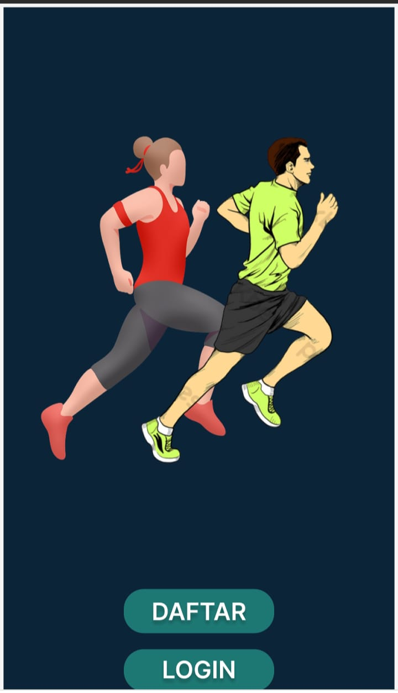

# Introduction

Latihan Rumahan kegiatan yang berkaitan dengan menjaga kesehatan dan kondisi fisik yang baik. Ini dapat dilakukan dengan beragam cara, seperti olahraga, latihan, dan perubahan gaya hidup. Kelebihan dari latihan rumahan ini yaitu kamu dapat memesan pelatih/coach pribadi yang akan membantu kamu mencapai tujuan kesehatan dan kondisi fisik kamu dengan lebih efektif. Pelatih pribadi akan memberikan kamu panduan yang dapat disesuaikan dengan kebutuhan kamu dan membuat rencana latihan yang sesuai dengan kemampuan kamu. Kamu dapat membangun otot dan menjaga kebugaran di rumah tanpa harus pergi ke pusat kebugaran. Mereka juga dapat memberikan dukungan moral dan memberikan umpan balik yang bermanfaat untuk memotivasi Anda untuk terus berlatih.

Latihan rumahan ini memiliki latihan untuk perut, dada, kaki, lengan, dan bokong serta latihan seluruh tubuh. Semua latihan dirancang oleh para ahli. Dengan  adanya pelatih, jadi kamu tidak perlu pergi ke pusat kebugaran.Latihan-latihan ini dapat membentuk otot secara efektif dan membantu Anda mendapatkan perut sixpack di rumah.

# Background

Ada banyak aplikasi latihan rumahan yang tersedia di pasaran, tetapi banyak di antaranya memiliki fitur yang sama semua atau kekurangan fitur penting. Tujuan dari pembuatan aplikasi latihan rumahan dengan adanya fitur pemesanan pelatih adalah untuk memberikan solusi kesehatan dan kebugaran yang lebih efektif dan personal bagi pengguna. Serta memberikan panduan latihan yang disesuaikan dengan kebutuhan pengguna, dengan bantuan dari pelatih pribadi yang dapat dipesan melalui aplikasi.

